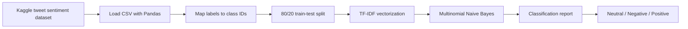

# Tweet Sentiment Classification | NLP Portfolio

[](https://www.python.org/)
[](https://scikit-learn.org/)
[](https://pandas.pydata.org/)
[](https://www.kaggle.com/datasets/sahideseker/tweet-sentiment-classification-dataset)

An end-to-end natural language processing project that classifies tweets as **neutral**, **negative**, or **positive**. The notebook demonstrates a compact, interpretable text-classification workflow: acquire the dataset from Kaggle, turn tweets into TF-IDF features, train a Multinomial Naive Bayes classifier, and evaluate its performance on a held-out test set.

---

## Portfolio Snapshot

| Area | Implementation |
| --- | --- |
| Problem | Three-class sentiment classification for tweets |
| Dataset | 1,000 labeled tweets from Kaggle |
| Features | English stop-word removal and TF-IDF vectorization |
| Model | Multinomial Naive Bayes |
| Validation | Reproducible 80/20 train-test split with `random_state=42` |
| Evaluation | Precision, recall, F1-score, and accuracy via scikit-learn |

> The current notebook records an accuracy of **1.00 on 200 test tweets**. This is a small dataset and an unusually high score deserves further validation on unseen or more diverse data before making production-performance claims.

---

## Workflow



---

## Model Approach

### 1. Dataset preparation

The source dataset contains two fields: `tweet` and `sentiment`. Sentiment labels are mapped to numeric targets:

| Label | Class ID |
| --- | --- |
| Neutral | `0` |
| Negative | `1` |
| Positive | `2` |

The data is split into training (80%) and test (20%) subsets using a fixed random seed for reproducibility.

### 2. Text representation

`TfidfVectorizer(stop_words="english")` converts tweets into sparse numerical features. TF-IDF gives higher weight to terms that are important within an individual tweet while down-weighting overly common terms across the corpus.

### 3. Classification and evaluation

A `MultinomialNB` classifier is fitted on the training feature matrix. The final notebook evaluates predictions with scikit-learn's classification report, including class-level precision, recall, and F1-score.

---

## Repository Structure

```text
tweet-sentiment-classification/
├── tweet-sentiment-classification.ipynb  # Full data download, training, and evaluation workflow
├── requirements.txt                      # Python dependencies
├── .gitignore                            # Excludes local data and Kaggle credentials
├── LICENSE                               # MIT license for repository code
└── README.md
```

---

## Run the Project

### 1. Clone and install dependencies

Use Python 3.10+ for this setup and install the pinned dependencies below.

```bash
git clone https://github.com/Panutle/tweet-sentiment-classification.git
cd tweet-sentiment-classification
python -m venv .venv
```

**Windows PowerShell**

```powershell
.\.venv\Scripts\Activate.ps1
python -m pip install -r requirements.txt
```

**macOS / Linux**

```bash
source .venv/bin/activate
python -m pip install -r requirements.txt
```

### 2. Set up Kaggle API access

1. Create an API token from your [Kaggle account settings](https://www.kaggle.com/settings).
2. Download `kaggle.json`.
3. Place it in the Kaggle configuration directory.

**Windows PowerShell**

```powershell
New-Item -ItemType Directory -Force "$env:USERPROFILE\.kaggle"
Move-Item .\kaggle.json "$env:USERPROFILE\.kaggle\kaggle.json"
```

Keep `kaggle.json` outside the repository. On macOS/Linux, place it at `~/.kaggle/kaggle.json` and restrict its permissions with `chmod 600 ~/.kaggle/kaggle.json`. The notebook uses the legacy JSON credential format supported by its pinned Kaggle client.

### 3. Open and run the notebook

```bash
jupyter notebook tweet-sentiment-classification.ipynb
```

Run all cells. The notebook downloads the dataset into `data/`, trains the model, and prints the evaluation report.

---

## Data Source and Attribution

The dataset is downloaded at runtime from Kaggle: [Tweet Sentiment Classification Dataset](https://www.kaggle.com/datasets/sahideseker/tweet-sentiment-classification-dataset) by `sahideseker`, licensed under CC BY-SA 4.0. The dataset is not included in this repository. The MIT license in this repository applies to the project code only, not to the external dataset.

---

## Future Improvements

- Add a stratified split and cross-validation for more robust estimates.
- Compare the baseline with logistic regression and transformer-based language models.
- Add text normalization for URLs, mentions, hashtags, and emojis.
- Export the trained vectorizer and classifier for reproducible inference.
- Include a confusion matrix and class-distribution analysis.
